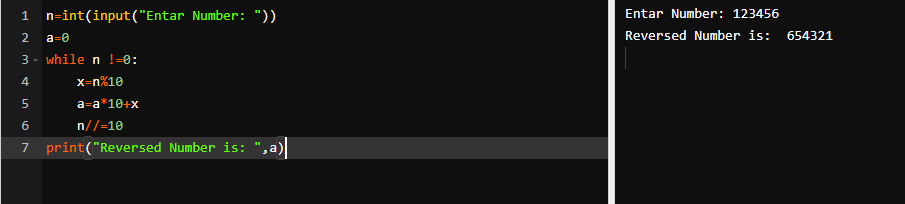
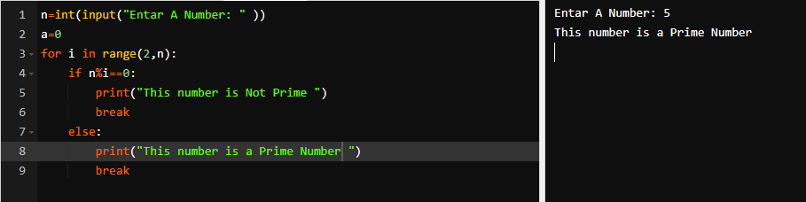
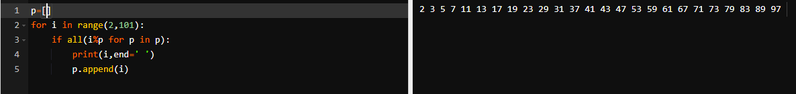
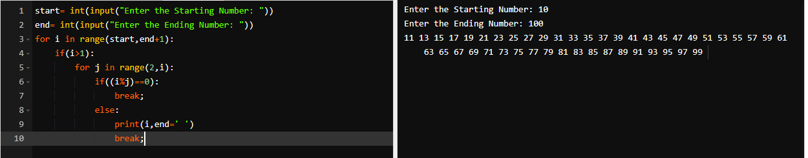
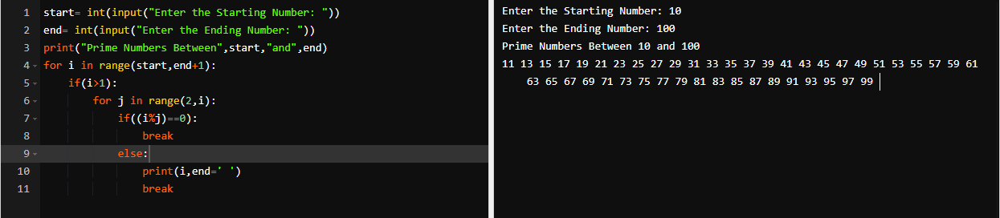
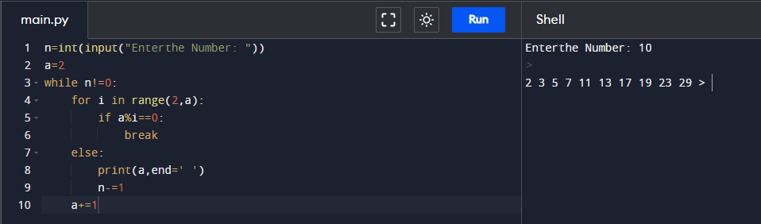
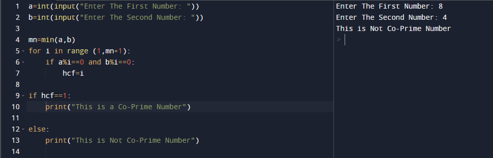
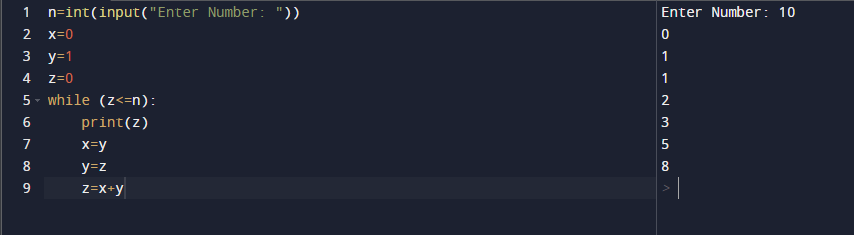
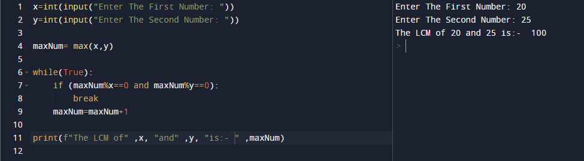
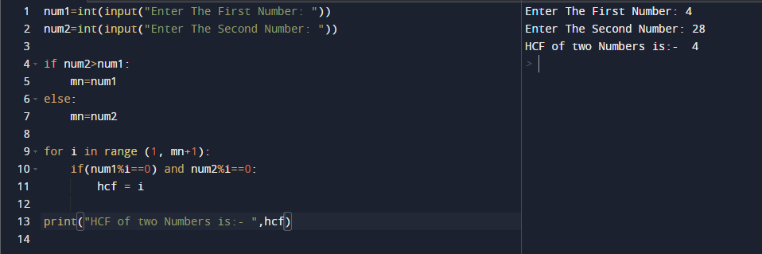

# Assignment - 12 Full Stack Web Development using Python MySirG More on loops

    Qns 1. Write a python script to reverse a number.

    Ans.

    Qns 2. Write a python script to check whether a given number is Prime or not.

    Ans.

    Qns 3. Write a python script to print all Prime numbers under 100.

    Ans.

    Qns 4. Write a python script to print all Prime numbers between two given numbers (both values inclusive).

    Ans.

    Qns 5. Write a python script to find next prime number of a given number.

    Ans.

    Qns 6. Write a python script to print first N prime numbers.

    Ans.

    Qns 7. Write a python script to check whether a given pair of numbers are co-Prime numbers or not.

    Ans.

    Qns 8. Write a python script to print first N terms of a Fibonacci series.

    Ans.

    Qns 9. Write a python script to calculate LCM of two numbers.

    Ans.

    Qns 10. Write a python script to calculate HCF of two numbers.

    Ans.

